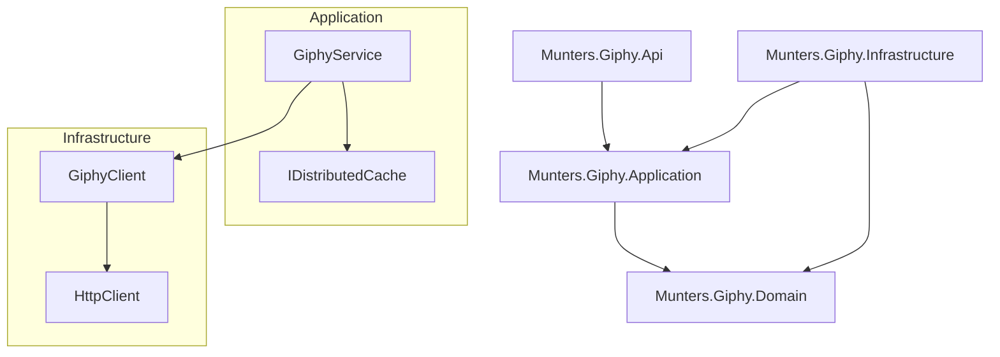

# Requirements

### Overview & Goals
The goal is to build a robust and extendable .NET Core Web API that integrates with the Giphy API. The application will support fetching trending GIFs and searching for GIFs by term, with a mandatory distributed caching layer to optimize performance and reduce API costs.

### Scope
- **In Scope**:
    - Clean Architecture project structure.
    - Giphy API integration via HttpClient.
    - Distributed caching mechanism (IDistributedCache).
    - HTTP endpoints for Trending and Search.
    - SOLID principles and Design Patterns implementation.
- **Out of Scope**:
    - Frontend/UI (as per user preference).
    - Persistent database (using Distributed Memory Cache).
    - User authentication/authorization.

### Functional Requirements
- **Fetch Trending GIFs**: Return a list of URLs for current trending GIFs.
- **Search GIFs**: Return a list of URLs for GIFs matching a search term.
- **Caching**: 
    - Trending results must be cached.
    - Search results for specific terms must be cached to prevent redundant API calls.
- **Concurrency**: Handle concurrent requests safely, especially around cache access.

# Technical Design

### Current Implementation
The project currently only contains the requirement documentation and an empty solution placeholder.

### Key Decisions
- **Architecture**: **Clean Architecture** to ensure high maintainability and testability.
- **Caching**: **Distributed Caching (`IDistributedCache`)** with a service-level caching pattern. This allows easy scaling and swapping of the cache provider (e.g., to Redis) without changing business logic.
- **API Style**: **Minimal APIs** in ASP.NET Core for a lightweight and high-performance entry point.
- **Giphy Client**: **Typed HttpClient** to encapsulate the Giphy API communication logic within the Infrastructure layer.

### Proposed Changes
- **Domain Layer**: Contains the core entities and interfaces that define the Giphy integration.
- **Application Layer**: Contains the business logic, specifically the `GiphyService` which orchestrates the caching and calling the client.
- **Infrastructure Layer**: Implements the `IGiphyClient` using `HttpClient` to fetch data from Giphy.
- **API Layer**: The presentation layer exposing endpoints and configuring the DI container.

### Architecture Diagram

### File Structure
- `src/Munters.Giphy.Domain/`
- `src/Munters.Giphy.Application/`
    - `Interfaces/`
    - `Services/`
    - `Models/`
- `src/Munters.Giphy.Infrastructure/`
    - `Clients/`
- `src/Munters.Giphy.Api/`
    - `Endpoints/`
    - `Program.cs`

# Testing

### Validation Approach
Verification will be performed by calling the exposed API endpoints and observing the behavior of the Giphy API calls (via logs/debug) and cache hits.

### Key Scenarios
- **Trending GIFs**: 
    - Call `/gifs/trending` multiple times.
    - Verify the first call hits Giphy API.
    - Verify subsequent calls return cached results without hitting Giphy.
- **Search GIFs**:
    - Call `/gifs/search?term=dog`.
    - Verify the call hits Giphy API.
    - Call `/gifs/search?term=dog` again; verify it's cached.
    - Call `/gifs/search?term=cat`; verify it hits Giphy (new term).

### Edge Cases
- **Giphy API Down**: Verify the application returns a meaningful error or cached data if available.
- **Empty Results**: Handle cases where Giphy returns no GIFs for a search term.
- **Concurrent Requests**: Multiple simultaneous requests for the same search term should ideally only trigger one Giphy API call (Cache Stampede protection).

# Delivery Steps

###   Step 1: Initialize Clean Architecture solution and project structure
A working .NET solution structure following Clean Architecture principles.

- Create the `Munters.Giphy.sln` solution.
- Create `Domain`, `Application`, `Infrastructure`, and `Api` projects.
- Set up project references according to Clean Architecture (Api -> Application -> Domain; Infrastructure -> Application).
- Configure `appsettings.json` with Giphy API placeholders (ApiKey, BaseUrl).

###   Step 2: Implement Giphy API Client and Domain Models
Defined abstractions and models for Giphy data.

- Define `IGiphyClient` interface in `Application`.
- Define `IGiphyService` interface in `Application`.
- Create domain models/DTOs for GIF metadata and search results.
- Implement the `GiphyClient` in `Infrastructure` using `HttpClient` to communicate with Giphy API.

###   Step 3: Implement Application Services with Distributed Caching
Core logic for fetching GIFs with caching integrated.

- Implement `GiphyService` in `Application`.
- Inject `IDistributedCache` into `GiphyService`.
- Implement `GetTrendingAsync` with cache-aside logic.
- Implement `SearchAsync` with cache-aside logic (using search term as cache key).
- Ensure safe concurrent operations by using `SemaphoreSlim` or similar if needed to prevent cache stampede.

###   Step 4: Implement Web API Endpoints and Dependency Injection
Exposed HTTP endpoints for Trending and Search.

- Configure Dependency Injection in `Program.cs`.
- Create `Trending` endpoint (GET `/gifs/trending`).
- Create `Search` endpoint (GET `/gifs/search?term={term}`).
- Map API responses to return only the list of URLs as requested.
- Add basic error handling and logging middleware.